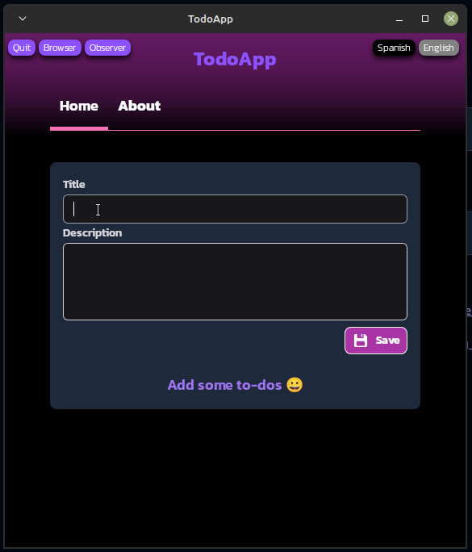

<div align="center">

# Elixir Desktop Todoapp

#### Elixir Todo App using the Desktop library with LiveView to create a desktop app

<br />



<br />

   

</div>

---

### 📖 Explanation

This is a sample desktop application that uses web technology for the `UI`. Developing desktop applications with a web interface is becoming the standard for such applications because they provide a pleasant `UX`, to which the user is already accustomed, and they allow developers to reuse knowledge and even some of the code they have already used in the backend of a website or the interface.

Frameworks/libraries such as [`ElectronJS`](https://www.electronjs.org/) (for JavaScript/NodeJS, although there is some rejection from some devs due to the size of its executables and the high resource consumption it demands from our machine), [`Tauri`](https://v2.tauri.app/) (for `Rust`) or [`Wails`](https://wails.io/) (for `Golang`), to mention the most used/recent technologies, are good examples of this. All of them have the advantage, in addition to the aforementioned advantages, of being fairly mature and proven libraries. However, they use a different language (JavaScript, Rust, Golang, etc.) for the backend than the frontend (which will likely be a JS framework [`React`, `Svelte`, `Vue`, `SolidJS`, etc.] or even vanilla JavaScript).

In this case, we use the [`Desktop`](https://hexdocs.pm/desktop/readme.html) library. While Desktop is not as mature or widely used a library as the ones mentioned (among other things, because `Elixir` or other languages ​​on the `BEAM VM` are less popular), it has the enormous advantage of "fully wrapping" an application made with the [`Phoenix`](https://hexdocs.pm/phoenix/Phoenix.html) + [`Liveview`](https://hexdocs.pm/phoenix_live_view/Phoenix.Component.html) framework. That is, we can "dump directly" the full potential of a Web application that we have already developed with Phoenix-Liveview directly into the desktop application, all by adding just over four lines of code and without leaving Elixir/Phoenix, in an astonishingly easy way.

`Desktop`, like the aforementioned libraries for other languages, allows for easy integration with the operating system and its windowing system by easily adding `native menu bars`, `pop-ups`, or `notifications` (see the [example application](https://github.com/elixir-desktop/desktop-example-app)). Unfortunately, this is not true for the latest versions of Phoenix-Liveview like the ones we use here (Phoenix v1.7.21 & Liveview v1.0). This results in the fact that when trying to create an application menu module in `XML`, as shown in the sample example, we receive a compiler warning (`cannot import Phoenix.HTML.sigil_e/2 because it is undefined or private`), which results in a runtime error.

However, the library works perfectly on older versions of Phoenix-Liveview(`Phoenix v1.7`, `Liveview v0.20`, `phoenix_html v3.3` y `phoenix_view v2.0`) if we choose to forgo the latter advantages offered by the versions we use here. However, it should be noted that the main [`contributor`](https://github.com/dominicletz) to the development of this library [`promises to update`](https://github.com/elixir-desktop/deployment/issues/7#issuecomment-2619596018) it to make it compatible with the latest versions of Phoenix-Liveview.

You can see the status of the library's [`roadmap`](https://hexdocs.pm/desktop/readme.html#status-roadmap) and what its authors intend to accomplish. Let's hope this fantastic project for the Elixir ecosystem continues to develop 🙏.

---

### 👨‍🚀 Getting Started

- ### <ins>Installing the application</ins>

  * #### Prerequisites:
  
    Obviously you will need to have both `Elixir` and `Erlang/OTP` installed. Regardless of the operating system you have, it is recommended to install both with the [`asdf`](https://asdf-vm.com/guide/getting-started.html) application (a tool version manager). This will not only allow you to install Elixir, Erlang/OTP, or NodeJS under multiple versions that you can easily change depending on your project's needs, but it will also give you the opportunity to configure your Erlang/OTP installation, which is vitally important in our case, as we'll see below. You should read carefully. You will need to carefully read the `asdf` installation instructions for your operating system and install the Erlang and Elixir plugins (`NodeJS` is optional in our case) that will then allow you to install these languages ​​on your system in addition to the [`BEAM virtual machine`](https://en.wikipedia.org/wiki/BEAM_(Erlang_virtual_machine)).
    
    >***As we just mentioned, installing Erlang requires a prior configuration that will allow us to have available on our system the `wxWidgets` library (which guarantees a graphical environment for Erlang, simply put) and `wxWebView` which is a WebView is a browser engine embedded within an application, allowing it to display web content without needing a separate browser window. It essentially acts as a miniature web browser within the app. First, you'll need to check which packages you should and shouldn't install based on your system. You can find information about the packages needed by `elixir-desktop` [`here`](https://hexdocs.pm/desktop/getting_started.html). For its part, the Erlang installation needs to activate some flags. You can find information about this [`here`](https://github.com/asdf-vm/asdf-erlang?tab=readme-ov-file#asdf-erlang) and [`here`](https://github.com/asdf-vm/asdf-erlang/issues/203#issuecomment-1519137578). You can activate the mentioned flags by exporting at least the following environment variables  (they are the ones truly required in our case) BEFORE installing Erlang con el comando `asdf install erlang <version>`:***

    ```
    $ export KERL_CONFIGURE_OPTIONS="--without-javac --enable-wx --enable-webview"
    ```

    Now you'll have Erlang, Elixir, and NodeJS (optional, as mentioned) installed and properly configured on your system. If you're planning to develop web content using the [`Phoenix framework`](https://hexdocs.pm/phoenix/overview.html) or simply modify this application, you'll need to install the Phoenix application generator `phx.new`. This is possible thanks to the fact that, in addition to Erlang/Elixir, we've also installed `IEx` (Elixir's interactive console) and its powerful project management tool Elixir, `Mix`:

    ```
    $ mix archive.install hex phx_new
    ```

  * #### Testing the application on our system (Window, MacOS, Linux):
    Once the prerequisites are met, we are ready to install the application on our system.

    First, clone this repository and point to the `deployment` branch:

    ```
    $ git clone https://github.com/emarifer/elixir-desktop-todoapp
    $ cd elixir-desktop-todoapp
    $ git checkout deployment
    ```

    Or directly clone the repository in the mentioned branch:

    ```
    $ git clone -b deployment https://github.com/emarifer/elixir-desktop-todoapp.git
    $ cd elixir-desktop-todoapp
    ```

    Install the dependencies with the following command (when installing Elixir we already have the `Mix` tool):

    ```
    $ mix deps.get
    ```

    Now we need to generate a secret key (which the Phoenix framework needs) and which will be "stored" in the production binary we are going to create:
    
    ```
    $ mix phx.gen.secret
    ```

    We copy the character sequence generated and export it as an environment variable (`SECRET_KEY_BASE`) for the current session of our terminal:

    ```
    $ export SECRET_KEY_BASE=qkm4wKDNXPmzSI7F6lqwcWw/gQu0fG6KxOV+iatmXBTIIZ3z383DuyD2YqgREq38 # (e.g.)
    ```

    Now we prepare the assets for production:

    ```
    $ mix assets.deploy
    ```

    And finally, we generate the binaries with the following command:

    ```
    $ mix desktop.installer
    ```

    This `Mix` tool task generates binary installers for your `Elixir-Desktop` project in the native formats corresponding to your OS. The output formats are:

      - `Windows`: .exe installer (NSIS-based)
      - `MacOS`: .dmg download package
      - `Linux`: .run makeself installer

    The creation of these binary installers (which may take some time, depending on your machine/OS), leaves the installers in the `_build/prod/` folder (`_build/prod/TodoApp-0.1.0-linux-x86_64.run` or the extension corresponding to your OS).

    If we run the installer, it will create a folder in the user's home folder (`TodoApp` on Linux, or in the location corresponding to your OS and with the appropriate integration to launch the application). This folder includes, like any Elixir release, the `BEAM VM` and `runtime`, the application-related binaries and the assets. It also packages all the (graphical) libraries your OS needs, which we installed in the previous steps, making it standalone. Therefore, the application would work, at least in theory, on any system just like the one we compiled it on. The downside is that it's quite large, so for Linux users, we've created a smaller version (see [below](#building-the-application-only-for-linux)).

    If something goes wrong in your case, you should review the [`documentation`](https://github.com/elixir-desktop/deployment?tab=readme-ov-file#generating-installers) for the library that compiles the application, called `deployment`, which was created by the authors of `Elixir-Desktop`.

  * #### Building the application only for Linux:

    Clone the `deployment-on-linux` branch directly and navigate to the project folder that was generated on your system:

    ```
    $ git clone -b deployment-on-linux https://github.com/emarifer/elixir-desktop-todoapp.git
    $ cd elixir-desktop-todoapp
    ```

    Now run the `linux-installer.sh` script (if you can't run it, give it execution permissions with `chmod +x linux-installer.sh`):

    ```
    $ ./linux-installer.sh
    ```

    The script will run the necessary configuration commands, compile the application as an Elixir `release`, and install the application for the local user by generating an entry in the start menu.

    The build size will be much smaller than that of the `deployment` library because it only strictly includes the artifacts corresponding to the application itself, the Erlang virtual machine, and the runtime. The disadvantage is that it does not include the graphical libraries (wxWidgets and webview), which must be installed on the system, otherwise the application will not start.

- ### <ins>Modifying the application (Dev mode)</ins>  

  If you've installed all the requirements outlined in the previous steps and want to modify the application, to improve your development experience you can install 3 excellent extensions if you work with VScode: [`ElixirLS`](https://marketplace.visualstudio.com/items?itemName=JakeBecker.elixir-ls), [`phoenixframework`](https://marketplace.visualstudio.com/items?itemName=phoenixframework.phoenix) and [`Tailwind CSS IntelliSense`](https://marketplace.visualstudio.com/items?itemName=bradlc.vscode-tailwindcss), and follow the instructions to correctly configure your work environment.

  So, to work with the application clone the repository (in the `main` branch) and enter the project folder:

  ```
  $ git clone https://github.com/emarifer/elixir-desktop-todoapp.git
  $ cd elixir-desktop-todoapp
  ```
  Now run the command in the terminal that starts any `Phoenix` application, although the command `iex -S mix` would also work:

  ```
  $ mix phx.server # or iex -S mix
  ```

  If you're using `Linux-Ubuntu` (or derivatives), it's quite possible that when you open the application window, it will be blank. This is a known issue that can be resolved by exporting the following environment variable for the current terminal session.

  ```
  $ export WEBKIT_DISABLE_COMPOSITING_MODE=1
  ```

  Alternatively, you can run a script (a `run` file) that does the same thing, but more conveniently. Each time you save changes to your code, the application window will reload. Likewise, if you paste the URL that appears in the terminal each time it reloads into your browser's address bar, you'll be able to view the application window in the browser and easily access its `development tools`.

---

### 📚 Learn more

  * You can see an excellent talk by its author about the `Elixir Desktop` library at [`Code BEAM V EU 2021`](https://codesync.global/conferences/code-beam-sto-2021/): https://www.youtube.com/watch?v=P6b-2RnPKBs
  * Official website: https://www.phoenixframework.org/
  * Guides: https://hexdocs.pm/phoenix/overview.html
  * Docs: https://hexdocs.pm/phoenix
  * Forum: https://elixirforum.com/c/phoenix-forum
  * Source: https://github.com/phoenixframework/phoenix

---

### Happy coding 😀!!